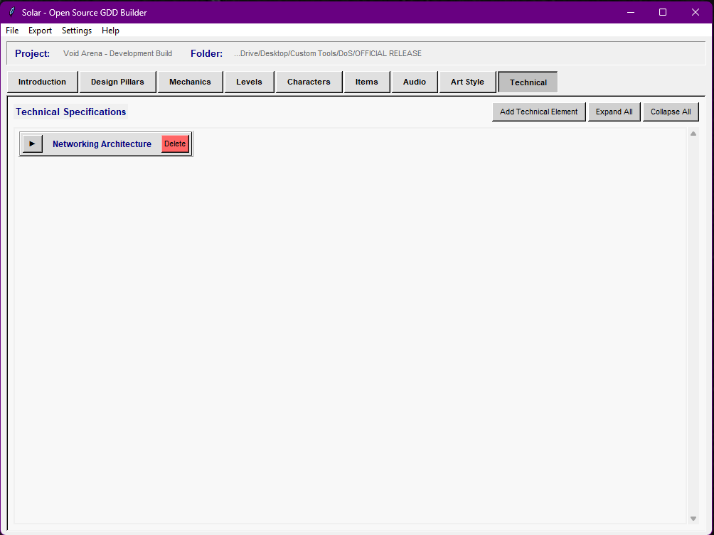
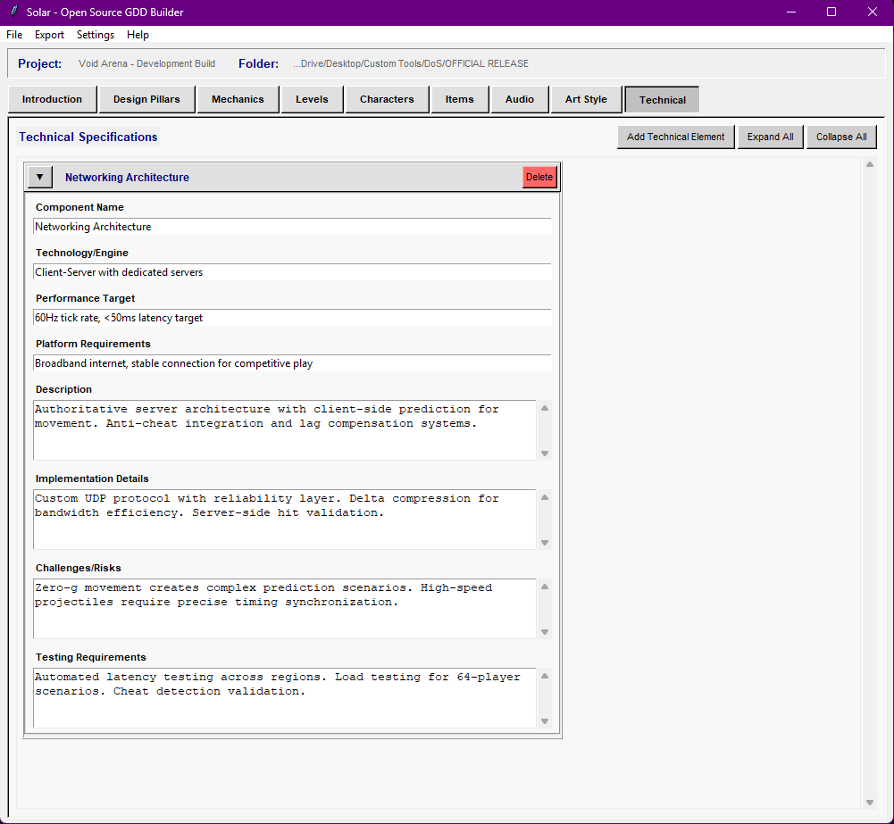
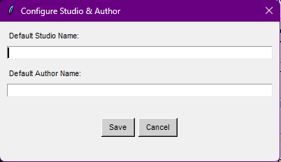

# Solar - The Open Source Game Design Document Builder

Solar is a desktop application for creating and maintaining Game Design Documents without relying on online services, proprietary tools, or rigid templates. It's designed for developers who want structured documentation that scales with a project, while still remaining easy to edit and version control.

Solar began as an internal tool built at Dead Orbit Studios to manage large, evolving GDDs. It has since been open-sourced for anyone who wants a practical, no-nonsense documentation workflow.

## Overview

Solar focuses on three core ideas:

- Keep documentation local and human-readable  
- Make large design documents manageable  
- Support real production workflows, including version control  

The application uses a simple desktop interface with collapsible entries to prevent large projects from becoming unreadable walls of text.

## Features

### Structured GDD Editing

- Static Introduction section for high-level project information and development timeline
- **Design Pillars section** for documenting core design principles and guidelines
- Dynamic sections for mechanics, levels, characters, items, audio, art, and technical design
- Collapsible entries to keep large documents navigable
- Entry headers update automatically based on name fields
- Comprehensive field coverage ensures no data is lost during export

<table align="center">
  <tr>
    <td align="center">
      <br>
      Intro Example
    </td>
    <td align="center">
      <br>
      Collapsed Entries
    </td>
    <td align="center">
      <br>
      Expanded Entries
    </td>
  </tr>
</table>

### Design Pillars Management

Solar includes a dedicated Design Pillars section to help teams maintain focus on core design principles:

- **Pillar Name**: Clear identification of each design principle
- **Core Principle**: The fundamental concept driving decisions
- **Why It Matters**: Importance and impact on the game experience
- **Implementation Guidelines**: Practical guidance for the development team
- **Examples in Game**: Concrete examples of the pillar in action

This ensures all team members understand and can refer back to the foundational design decisions throughout development.

### Export Options

- Microsoft Word (.docx) export with clean section formatting and complete field coverage
- Plain text export for portability and backups with full data preservation
- JSON project files for native saving and version control
- Structured file export that generates folders and individual `.txt` files per entry
- Consistent author and studio attribution across all export formats

All exports now include every field from every section, ensuring complete data preservation regardless of export format chosen.

The structured export is designed specifically for Git-based workflows, allowing granular diffs and modular collaboration.

### Quality-of-Life Features

- Persistent settings (project folder, window size, author/studio info)
- Cross-platform support (Windows, macOS, Linux)
- Runs as a Python script or standalone Windows executable
- No accounts, no cloud services, fully offline
- Clean, professional exports without repetitive footer credits
- Configurable studio and author information with consistent export formatting

<p align="center">
  
</p>

## Installation

### Option 1: Windows Executable

1. Download `Solar.exe` from the Releases page
2. Run directly (no installer required)
3. Set a project folder and begin documenting

### Option 2: Run From Source (All Platforms)

```bash
git clone https://github.com/mikeybowman/Solar.git
cd Solar
pip install -r requirements.txt
python gdd_builder.py
```

### Option 3: Build Your Own Executable

```bash
pip install pyinstaller python-docx
build_exe.bat
```
You may also build manually using PyInstaller if you need custom options.

### Basic Workflow

1. Launch Solar and configure studio and author information
2. Set a project folder (remembered between sessions)
3. Fill out the Introduction tab with project details and development timeline
4. Define your core Design Pillars to guide development decisions
5. Add entries to each section as needed (mechanics, levels, characters, etc.)
6. Save progress using the JSON project format
7. Export to Word, text, or structured files when required

### File Structure Export

The structured export mirrors the internal layout of the application:
```bash
YourGame_GDD/
├── README.txt
├── 01_Introduction/
├── 02_Design_Pillars/
├── 03_Mechanics/
├── 04_Levels/
├── 05_Characters/
├── 06_Items/
├── 07_Audio/
├── 08_Art_Style/
└── 09_Technical/
```
Each entry is written to its own file, making it easy to track changes, review diffs, and share specific sections with collaborators.

<p align="center">
  
</p>

### Design Philosophy

Solar intentionally avoids modern web-app design patterns. The interface is simple, predictable, and focused on readability. The collapsible entry system exists to solve a real problem: GDDs grow faster than most tools can handle.

The addition of Design Pillars reflects the reality of professional game development: successful projects maintain clear vision throughout development by documenting and referencing core design principles.

The goal is to stay out of the way and let the documentation speak for itself.

### Development Notes

- GUI: Tkinter (for maximum compatibility)
- Data storage: JSON (human-readable, version-control friendly)
- Word export: python-docx with complete field coverage
- Settings: JSON-based with sane defaults
- Architecture: Modular tab system for easy feature additions

The codebase is intentionally straightforward. Adding new sections or fields follows established patterns and does not require major refactoring.

### Recent Updates (v1.1.0)

**New Features:**
- Design Pillars tab for documenting core design principles
- Complete field export coverage across all categories
- Enhanced author attribution in all export formats

**Bug Fixes:**
- Fixed missing fields in Word document exports
- Resolved inconsistent author information across export formats
- Cleaned up repetitive footer credits

**Improvements:**
- Updated section numbering to accommodate Design Pillars
- Standardized export formatting across all output types
- Enhanced data preservation during exports

### Contributing

Contributions are welcome.

- Bug reports and feature requests can be filed as GitHub issues
- Pull requests should follow existing code structure and style
- Documentation improvements are appreciated

If you fork Solar for your own workflow, feel free to adapt it as needed.

### Documentation Contributions

If you’d like to improve documentation:
- Open a Pull Request with your changes, **or**
- Paste proposed Markdown directly into an Issue or Discussion

Please do not send files via external links unless requested.

### Use Cases

Solar is suitable for:

- Independent studios maintaining production documentation
- Game design students learning industry-standard structure and design pillar methodology
- Hobby developers organizing long-term projects
- Educators teaching documentation and design planning
- Teams that need to maintain design consistency across development cycles

### Security & Integrity
### SHA-256 Checksums

For released binaries, SHA-256 checksums are provided to verify file integrity.

```bash
Version: 1.1.0
File: Solar.exe
Size: 17919078 bytes
SHA256: d2559b67bc01448f7196f826911c2265efc8444713a2baacf9818260fec820d4
```
Always verify checksums before running downloaded executables.

**To generate hash:**
```bash
# Windows
certutil -hashfile Solar.exe SHA256

# Linux/Mac
sha256sum Solar.exe
```

# License
Solar is open source software. See the LICENSE file for details.

# Credits
Original creator: Mikey LaBrecque
Studio: Dead Orbit Studios

Solar exists to make game design documentation easier to manage and easier to maintain. If it helps you organize ideas, maintain design consistency, or ship a project, it's doing its job.
