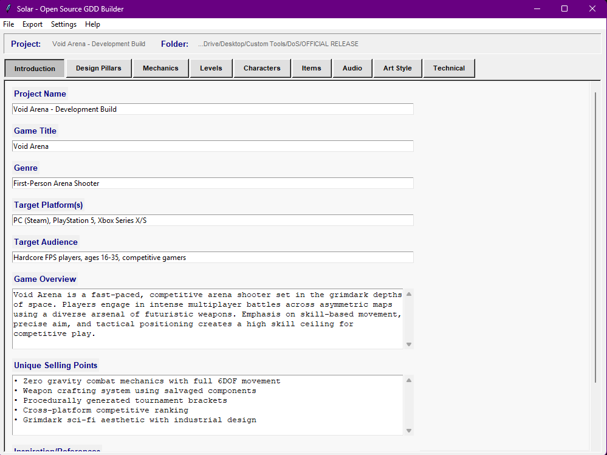
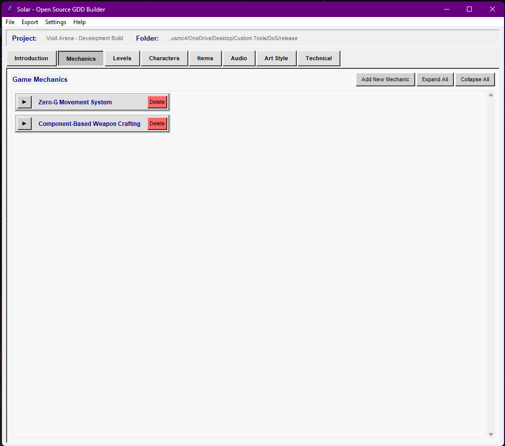
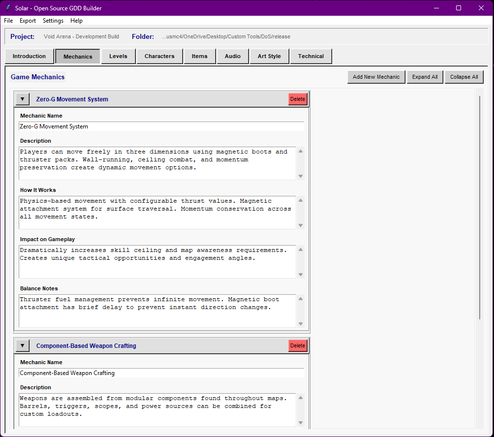
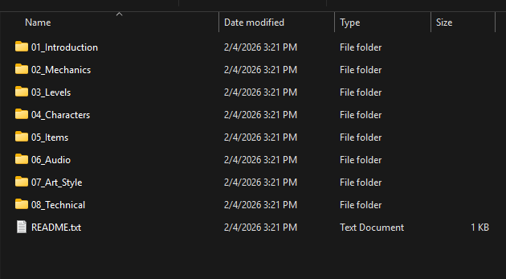

# Solar - The Open Source Game Design Document Builder

Solar is a desktop application for creating and maintaining Game Design Documents without relying on online services, proprietary tools, or rigid templates. It’s designed for developers who want structured documentation that scales with a project, while still remaining easy to edit and version control.

Solar began as an internal tool built at Dead Orbit Studios to manage large, evolving GDDs. It has since been open-sourced for anyone who wants a practical, no-nonsense documentation workflow.

## Overview

Solar focuses on three core ideas:

- Keep documentation local and human-readable  
- Make large design documents manageable  
- Support real production workflows, including version control  

The application uses a simple desktop interface with collapsible entries to prevent large projects from becoming unreadable walls of text.

## Features

### Structured GDD Editing

- Static Introduction section for high-level project information
- Dynamic sections for mechanics, levels, characters, items, audio, art, and technical design
- Collapsible entries to keep large documents navigable
- Entry headers update automatically based on name fields

<table align="center">
  <tr>
    <td align="center">
      <br>
      Intro Example
    </td>
    <td align="center">
      <br>
      Collapsed Entries
    </td>
    <td align="center">
      <br>
      Expanded Entries
    </td>
  </tr>
</table>

### Export Options

- Microsoft Word (.docx) export with clean section formatting
- Plain text export for portability and backups
- JSON project files for native saving and version control
- Structured file export that generates folders and individual `.txt` files per entry

The structured export is designed specifically for Git-based workflows, allowing granular diffs and modular collaboration.

### Quality-of-Life Features

- Persistent settings (project folder, window size, author/studio info)
- Cross-platform support (Windows, macOS, Linux)
- Runs as a Python script or standalone Windows executable
- No accounts, no cloud services, fully offline

## Installation

### Option 1: Windows Executable

1. Download `Solar.exe` from the Releases page
2. Run directly (no installer required)
3. Set a project folder and begin documenting

### Option 2: Run From Source (All Platforms)

```bash
git clone https://github.com/mikeybowman/Solar.git
cd Solar
pip install -r requirements.txt
python gdd_builder.py
```

### Option 3: Build Your Own Executable

```bash
pip install pyinstaller python-docx
python build_solar.py
```
You may also build manually using PyInstaller if you need custom options.

### Basic Workflow

1. Launch Solar and configure studio and author information
2. Set a project folder (remembered between sessions)
3. Fill out the Introduction tab with project details
4. Add entries to each section as needed
5. Save progress using the JSON project format
6. Export to Word, text, or structured files when required

### File Structure Export

The structured export mirrors the internal layout of the application:
```bash
YourGame_GDD/
├── README.txt
├── 01_Introduction/
├── 02_Mechanics/
├── 03_Levels/
├── 04_Characters/
├── 05_Items/
├── 06_Audio/
├── 07_Art_Style/
└── 08_Technical/
```
Each entry is written to its own file, making it easy to track changes, review diffs, and share specific sections with collaborators.

<p align="center">
  
</p>

### Design Philosophy

Solar intentionally avoids modern web-app design patterns. The interface is simple, predictable, and focused on readability. The collapsible entry system exists to solve a real problem: GDDs grow faster than most tools can handle.

The goal is to stay out of the way and let the documentation speak for itself.

### Development Notes

- GUI: Tkinter (for maximum compatibility)
- Data storage: JSON (human-readable, version-control friendly)
- Word export: python-docx
- Settings: JSON-based with sane defaults

The codebase is intentionally straightforward. Adding new sections or fields follows established patterns and does not require major refactoring.

### Contributing

Contributions are welcome.

- Bug reports and feature requests can be filed as GitHub issues
- Pull requests should follow existing code structure and style
- Documentation improvements are appreciated

If you fork Solar for your own workflow, feel free to adapt it as needed.

### Use Cases

Solar is suitable for:

- Independent studios maintaining production documentation
- Game design students learning industry-standard structure
- Hobby developers organizing long-term projects
- Educators teaching documentation and design planning

### Security & Integrity
### SHA-256 Checksums

For released binaries, SHA-256 checksums are provided to verify file integrity.

```bash
File: Solar.exe
Size: 17907290 bytes
SHA256: 772113d0b3e58fa2ed1fe8124d49d21a352fd64c1c3fd777e9eae04ca6784dc8
```
Always verify checksums before running downloaded executables.

# License
Solar is open source software. See the LICENSE file for details.

# Credits
Original creator: Mikey LaBrecque
Studio: Dead Orbit Studios

Solar exists to make game design documentation easier to manage and easier to maintain. If it helps you organize ideas or ship a project, it’s doing its job.
